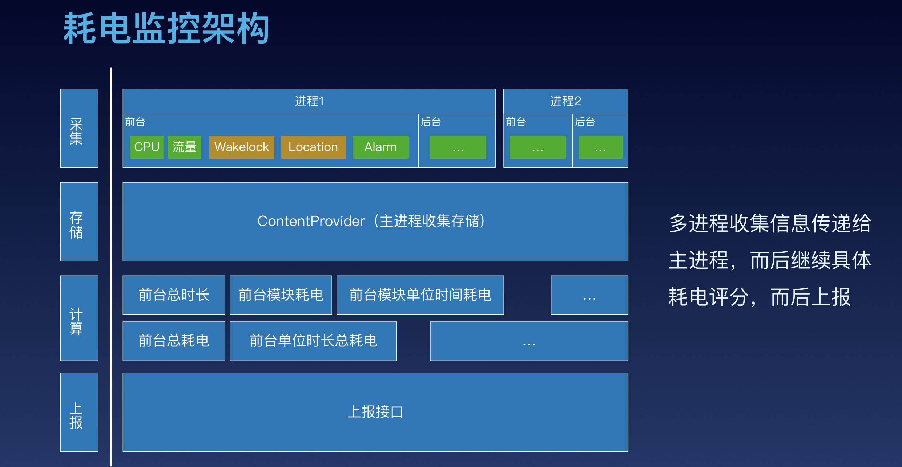

# Performance-optimization

# 一. 性能优化方向:

##### 1.内存优化
##### 2.卡顿优化
##### 3.布局优化
##### 4.启动优化
##### 5.包体积优化
##### 6.网络优化
##### 7.电量优化
##### 8.业务角度优化
##### 9.编译优化

# 二. 性能优化难点:

##### 1.没有统一的标准
##### 2.用户的机器环境相关性较大
##### 3.手机不能拿来调试,也有可能是特定的时机才会出问题，过后就不能重现了 
##### 4.操作路径长，日志无法准确打点

# 三. 文档资料:

## 专题文档:

[苹果官方 Performance 专题](https://developer.apple.com/library/archive/navigation/#section=Topics&topic=Performance)

## 书籍文档:
[High Performance iOS](./doc/OReilly.High.Performance.iOS.Apps.2016.6.pdf)

[Pro iOS App Performance Optimization](./doc/Pro_ios_apps_performance_optimization.pdf)

## WWWDC 文档:

[WWDC文档](./doc/WWDC/)

## GMTC 文档:

[GMTC 2019](https://gmtc.infoq.cn/2019/beijing/#theme)

[GMTC 2018](https://gmtc.infoq.cn/2018/beijing/#theme)

[GMTC 2017](http://gmtc2017.geekbang.org/#theme)

[GMTC 2016](http://gmtc2016.geekbang.org/#theme)

## QConChina:

[QConBeijing2016](https://github.com/QConChina/QConShanghai2016)

[QConBeijing2017](https://github.com/QConChina/QConBeijing2017)

[QConBeijing2018](https://github.com/QConChina/QConShanghai2018)

[QConBeijing2019](https://github.com/QConChina/QConBeijing2019)

## APMCon:

[中国应用性能管理大会](http://apmcon.cn/2016/index.html#yjsl)

# 四. 业界方案:

[微信读书 iOS 性能优化总结](http://wereadteam.github.io/2016/05/03/WeRead-Performance/)

[微信读书 iOS 质量保证及性能监控](http://wereadteam.github.io/2016/12/12/Monitor/)

[微信iOS卡顿监控系统](https://mp.weixin.qq.com/s?__biz=MzAwNDY1ODY2OQ%3D%3D&idx=1&mid=207890859&scene=23&sn=e98dd604cdb854e7a5808d2072c29162&srcid=0921FzoCw9j1W7n4uFYKuarC#rd)

[iOS微信内存监控](https://wetest.qq.com/lab/view/367.html)

[微信客户端团队负责人技术访谈：如何着手客户端性能监控和优化](http://www.52im.net/thread-921-1-1.html)

判断标准:
- FPS 降低
- CPU 占用率很高 (CPU 占用超过了100%)
- 主线程 Runloop 执行了很久(抢锁或大量 IO)(主线程 Runloop 执行了超过2秒)

工具及方法：

##### 采取的措施：

1. 现网用户的卡顿状况通过接入bugly卡顿监控，通过下发配置，对现网用户进行抽样检测，bugly的依据是监控主线程Runloop的执行，观察执行耗时是否超过预定阀值(默认阀值为3000ms)以及用户点击流来监控页面的流畅程度。在监控到卡顿时会立即记录线程堆栈到本地，在App从后台切换到前台时，执行上报。

检测策略:
****内存 dump****：每1秒检查一次，如果检查到主线程卡顿，就将所有线程的函数调用堆栈 dump 到内存中。
****文件 dump***：如果内存 dump 的堆栈跟上次捕捉到的不一样，则 dump 到文件中；否则按照斐波那契数列将检查时间递增（1，1，2，3，5，8…）直到没有遇到卡顿或卡顿堆栈不一样。这样能够避免同一个卡顿写入多个文件的情况，也能避免检测线程围着同一个卡顿空转的情况。

4. 可运营

在正式发布之前，我们进行了灰度，以评估卡顿对用户的影响。收集到的结果是用户平均每天会产生30个 dump 文件，压缩上传大约要 300k 流量。预计正式发布的话会对后台有比较大的压力，对用户也有一定流量损耗。所以必须进行抽样上报。

抽样上报：每天抽取不同的用户进行上报，抽样概率是5%。
文件上传：被抽中的用户1天仅上传前20个堆栈文件，并且每次上报会进行多文件压缩上传。
白名单：对于需要跟进问题的用户，可以在后台配置白名单，强制上报。

另外，为了减少对用户存储空间的影响，卡顿文件仅保存最近7天的记录，过期删除。

2. 网络层成功率的监控：
统计网络请求的成功、失败率，了解所有错误码的分布情况在app新版本上线，下发补丁包，后台新功能上线，活跃用户等数据出现异常以及，用户投诉时候定期查看数据。

##### 使用到的工具：

##### 1. 内存泄露检测工具 ****MLeakFinder**** 

[TODO 原理介绍]

##### 2. FPS/SQL性能监测工具条

该工具条是在DEBUG模式下，以浮窗的形式。实时展示当前可能存在问题的FPS次数和执行时间较长的SQL语句个数，随时查看FPS低于某个阈值时的堆栈信息，当FPS低于30的时候，就会捕获所有线程堆栈，浮窗会给出红色警示，可点击查看具体的堆栈信息,再结合当时的使用场景,可以很快定位到引起卡顿的场景和原因.

因此在DEBUG阶段，我们监测了每一条SQL语句的执行速度，一旦执行时间超出某个阈值，就会表现在工具条的数字上，点击后可以进一步查询到具体的SQL操作以及实际耗时。

##### 3. UI/DataSource主线程检测工具

由于大部分UI操作是非线程安全，所有继承自UIResponder的类都需要在主线程操作，在非UI线程中操作UI可能会导致app突然丢动画，UI操作偶尔响应特别慢，莫名的crash 这些问题。UI/DataSource主线程检测工具通过 hook UIView, CALayer 的 ****-setNeedsLayout****，****-setNeedsDisplay****，****-setNeedsDisplayInRect**** 三个方法，确保它们都是在主线程执行。

[手Q iOS客户端性能监控和优化实践](https://static001.geekbang.org/con/42/pdf/3377855748/file/%E7%BD%97%E9%91%AB-%E6%89%8BQiOS%E6%80%A7%E8%83%BD%E7%9B%91%E6%8E%A7%E5%92%8C%E4%BC%98%E5%8C%96%E5%AE%9E%E8%B7%B5.pdf)

[iOS内存监控组件 OOMDetector](https://github.com/Tencent/OOMDetector)

[LinkedIn移动应用的性能优化之道](https://ppt.infoq.cn/slide/show?cid=31&pid=1495)
* 先从架构入手，引入组件化，化简架构，建立统一标准规范。
* 数据采集 - 端上性能数据采集 + 业务数据采集监控

注意点：面向切面，避免侵入业务，上传时机（服务器压力+数据实效性）,业务优先级

[去哪儿网客户端无埋点监控与性能优化实践](https://static001.geekbang.org/con/42/pdf/105012734/file/%E5%AD%9F%E8%B6%85-qunar-%E5%8E%BB%E5%93%AA%E5%84%BF%E7%BD%91%E5%85%AC%E5%85%B1%E4%BA%A7%E5%93%81%E9%83%A8%E5%A4%A7%E5%89%8D%E7%AB%AF%E8%B4%9F%E8%B4%A3%E4%BA%BA.pdf)

[字节跳动线上性能监控体系的建设](https://static001.geekbang.org/con/42/pdf/2562453822/file/%E4%B8%87%E9%87%8C%E9%B9%8F&mdash;%E5%AD%97%E8%8A%82%E8%B7%B3%E5%8A%A8%E7%BA%BF%E4%B8%8A%E6%80%A7%E8%83%BD%E7%9B%91%E6%8E%A7%E4%BD%93%E7%B3%BB%E7%9A%84%E5%BB%BA%E8%AE%BE.pdf)

[蘑菇街 App 的稳定性与性能实践](http://pstatic.geekbang.org/pdf/5809d9ef9b45b.pdf?e=1491025393&token=eHNJKRTldoRsUX0uCP9M3icEhpbyh3VF9Nrk5UPM:lKVEa3b-uxMSKW75daZyi0p32aQ=)

[美团客户端监控与异常排查实践](https://ppt.infoq.cn/slide/show?cid=31&pid=1500)

[0.3秒完成渲染！信息流内容页“闪开”优化总结和思考](https://static001.geekbang.org/con/42/pdf/3069718189/file/%E5%BA%9E%E9%94%A6%E8%B4%B5-%E4%BF%A1%E6%81%AF%E6%B5%81%E5%86%85%E5%AE%B9%E9%A1%B5&ldquo;%E9%97%AA%E5%BC%80&rdquo;%E4%BC%98%E5%8C%96%E6%80%BB%E7%BB%93.pdf)

[爱奇艺APP极致体验之路](https://ppt.infoq.cn/slide/show?cid=31&pid=1497)

[从重新认识前端渲染开始，小红书的前端性能监控及优化实践](https://static001.geekbang.org/con/42/pdf/988645838/file/%E6%9D%8E%E5%AD%A3%E9%AA%8F-%E5%B0%8F%E7%BA%A2%E4%B9%A6-%E7%A4%BE%E5%8C%BA%E5%89%8D%E7%AB%AF%E5%B7%A5%E7%A8%8B%E5%B8%88.pdf)

[⼿淘iOS性能优化探索](http://pstatic.geekbang.org/pdf/593a53d813cef.pdf?e=1497499485&token=eHNJKRTldoRsUX0uCP9M3icEhpbyh3VF9Nrk5UPM:sa-xp_aIeIhtiWbqR-hY4ImMzFc=)

[B站的视频体验进化之路](https://static001.geekbang.org/con/42/pdf/3841774823/file/%E8%B0%AD%E5%85%86%E6%AD%86&mdash;GMTC%20B%E7%AB%99%E7%9A%84%E8%A7%86%E9%A2%91%E4%BD%93%E9%AA%8C%E8%BF%9B%E5%8C%96%E4%B9%8B%E8%B7%AF%20-%20bilibili%20.pdf)

[iOS App 稳定性指标及监测](https://juejin.cn/post/6844903488757973006)

[移动端监控体系之技术原理剖析](https://www.jianshu.com/p/8123fc17fe0e)

[搜狗输入法性能优化实践](https://github.com/MDCC2016/iOS-Session-Slides/blob/master/%E6%90%9C%E7%8B%97%E8%BE%93%E5%85%A5%E6%B3%95%E6%80%A7%E8%83%BD%E4%BC%98%E5%8C%96%E5%AE%9E%E8%B7%B5-%E6%9D%8E%E8%85%BE%E6%9D%B0.pdf)

[iOS应用UI线程卡顿监控](https://mp.weixin.qq.com/s?__biz=MzI5MjEzNzA1MA==&mid=2650264136&idx=1&sn=052c1db8131d4bed8458b98e1ec0d5b0&chksm=f406837dc3710a6b49e76ce3639f671373b553e8a91b544e82bb8747e9adc7985fea1093a394#rd)

[iOS-APM-Secrets 揭秘 APM iOS SDK 的核心技术](https://github.com/aozhimin/iOS-APM-Secrets)

[网易 NeteaseAPM iOS SDK 技术实现分享](https://www.infoq.cn/article/netease-ios-sdk-neteaseapm-technology-share/)

应用性能分析
对当前应用请求的各项性能指标进行分析，如响应时间，吞吐量，下载速率等，帮助用户全面了解应用性能表现。

错误分析
分析应用每个域名的网络错误率及响应码错误率，快速定位应用问题。

多维分析
可以组合域名，地理位置，运营商，网络环境等参数，精确定位应用的性能问题。

网络请求的响应时间，下载速率，状态码，错误码，网络状态等数据的收集；

页面加载时间的收集，检查出慢交互页面；

[iOS 性能监控 SDK —— Wedjat（华狄特）开发过程的调研和整理](https://github.com/aozhimin/iOS-Monitor-Platform)

[Optimizing Facebook for iOS start time](https://engineering.fb.com/2015/11/20/ios/optimizing-facebook-for-ios-start-time/)

[如何实现一个IOS网络监控组件](https://www.jianshu.com/p/c025dd2ac9cc)

[性能可视化实践之路](http://www.doc88.com/p-3072311816896.html)

[听云 - 移动 App 性能监测](http://createsz.com/upload/files/2017/4/%E5%90%AC%E4%BA%91APP%E7%A7%BB%E5%8A%A8%E5%BA%94%E7%94%A8%E6%80%A7%E8%83%BD%E7%AE%A1%E7%90%86%E8%A7%A3%E5%86%B3%E6%96%B9%E6%A1%88.pdf)

[iOS无埋点数据SDK实践之路](https://www.jianshu.com/p/69ce01e15042)

[网易HubbleData无埋点SDK在iOS端的设计与实现](https://www.jianshu.com/p/f0c4e280357c)

[美团移动端性能监控方案Hertz](https://tech.meituan.com/2016/12/19/hertz.html)

[美团点评移动端性能监控方案Hertz](https://pic.huodongjia.com/ganhuodocs/2017-12-20/1513734352.2.pdf)

[360移动端性能监控实践QDAS-APM](https://zhuanlan.51cto.com/art/201907/598907.htm)

[360移动端性能监控实践 PPT](https://ppt.baomitu.com/d/b7a5169c#/)

# 五. 专项:

- ****网络优化****

- [美团点评移动网络优化实践](https://tech.meituan.com/2017/03/17/shark-sdk.html)

- [开源版HttpDNS方案详解](https://mp.weixin.qq.com/s?__biz=MzAwMDU1MTE1OQ==&mid=209805123&idx=1&sn=ced8d67c3e2cc3ca38ef722949fa21f8)

- [携程 App 的网络性能优化实践](https://www.infoq.cn/article/how-ctrip-improves-app-networking-performance/)

- [2016 年携程 App 网络服务通道治理和性能优化实践](https://www.infoq.cn/article/app-network-service-and-performance-optimization-of-ctrip/)

- [蘑菇街 App Chromium 网络栈实践](https://www.infoq.cn/article/mogujie-app-chromium-network-layer/)

- [移动 APP 网络优化概述](http://blog.cnbang.net/tech/3531/?hmsr=toutiao.io&utm_medium=toutiao.io&utm_source=toutiao.io)

- ****内存优化:****

- [Memory Usage Performance Guidelines](https://developer.apple.com/library/archive/documentation/Performance/Conceptual/ManagingMemory/ManagingMemory.html#//apple_ref/doc/uid/10000160i)

- [iOS Memory Deep Dive](https://developer.apple.com/videos/play/wwdc2018/416/)

- [探索iOS内存分配](https://juejin.cn/post/6844903551366332423)

- [OOM探究：XNU 内存状态管理](https://www.jianshu.com/p/4458700a8ba8)

- ****卡顿优化:****

- [UIKit性能调优实战讲解](http://www.cocoachina.com/articles/15238)

- [QQ空间掉帧率优化实战](https://wetest.qq.com/lab/view/354.html)

- [实现 60fps 的网易云音乐首页](https://mp.weixin.qq.com/s?__biz=MzA4MzEwOTkyMQ==&mid=2667379069&idx=1&sn=376d9ef2261cf13e930406f1c35d3569)

- [iOS 保持界面流畅的技巧](https://blog.ibireme.com/2015/11/12/smooth_user_interfaces_for_ios/)

- [iOS 性能优化总结](http://www.cocoachina.com/articles/22990)

- [iOS实时卡顿监控](https://www.cnblogs.com/gatsbywang/p/5555200.html)

- [iOS应用UI线程卡顿监控](https://mp.weixin.qq.com/s?__biz=MzI5MjEzNzA1MA==&mid=2650264136&idx=1&sn=052c1db8131d4bed8458b98e1ec0d5b0&chksm=f406837dc3710a6b49e76ce3639f671373b553e8a91b544e82bb8747e9adc7985fea1093a394#rd)

- ****布局优化****

- ****电量优化****

- [Energy Efficiency Guide for iOS Apps](https://developer.apple.com/library/archive/documentation/Performance/Conceptual/EnergyGuide-iOS/index.html#//apple_ref/doc/uid/TP40015243-CH3-SW1)

- [Writing Energy Efficient Apps](https://developer.apple.com/videos/play/wwdc2017/238/)

- [iOS 常见耗电量检测方案调研](https://github.com/ChenYilong/iOSBlog/issues/10)

- [教你开发省电的 iOS app（WWDC17 观后）](https://www.jianshu.com/p/f0dc653d04ca)

- [浅析移动蜂窝网络的特点及其省电方案](https://juejin.cn/post/6844903511608524813)

- [iOS进阶--App功耗优化看这篇就够了](http://www.cocoachina.com/articles/21428)

- ****启动优化****

- [Optimizing App Startup Time](https://developer.apple.com/videos/play/wwdc2016/406)

- [App Startup Time: Past, Present, and Future](https://developer.apple.com/videos/play/wwdc2017/413)

- [如何精确度量 iOS App 的启动时间](https://www.jianshu.com/p/c14987eee107)

- [优化 App 的启动时间](http://yulingtianxia.com/blog/2016/10/30/Optimizing-App-Startup-Time/)

- [抖音 iOS 启动优化实战](https://www.infoq.cn/article/tx0tcv9h6lkvknokqn7i)

- [今日头条iOS客户端启动速度优化](http://www.cocoachina.com/articles/18651)

- [iOS App 启动性能优化](https://mp.weixin.qq.com/s/Kf3EbDIUuf0aWVT-UCEmbA)

- [Facebook iOS App如何优化启动时间](http://www.cocoachina.com/articles/14870)

- [iOS输入法启动速度优化](https://wenku.baidu.com/view/503f0b0649d7c1c708a1284ac850ad02de8007ea)

- [[iOS]一次立竿见影的启动时间优化](https://juejin.cn/post/6844903525172903944)

- [Mach-O 可执行文件](https://objccn.io/issue-6-3/)

- [iOS app启动速度研究实践](https://zhuanlan.zhihu.com/p/38183046?from=1086193010&wm=3333_2001&weiboauthoruid=1690182120)

- [iOS App冷启动治理：来自美团外卖的实践](https://mp.weixin.qq.com/s/jN3jaNrvXczZoYIRCWZs7w)

- ****包体优化****

- [iOS微信安装包瘦身](https://mp.weixin.qq.com/s?__biz=MzAwNDY1ODY2OQ==&mid=207986417&idx=1&sn=77ea7d8e4f8ab7b59111e78c86ccfe66&scene=24&srcid=0921TTAXHGHWKqckEHTvGzoA#rd)

- [今日头条 iOS 安装包大小优化—— 新阶段、新实践](https://www.infoq.cn/article/iowjwhbirqeobzf5m2o8)

- [iOS 瘦身之删除 FrameWork 中无用 mach-O 文件](https://www.infoq.cn/article/ios-thinning-delete-unnecessary-mach-o/)

- [基于 clang 插件的一种 iOS 包大小瘦身方案](https://www.infoq.cn/article/clang-plugin-ios-app-size-reducing/)

- [iOS可执行文件瘦身方法](http://blog.cnbang.net/tech/2544/)

- [iOS 端瘦身实践的 Slides](https://ming1016.github.io/2017/06/12/gmtc-ios-slimming-practice/)

- ****编译优化****

- ****构建优化****

# 六. 相关辅助调试工具及开源库:

- [Lookin](https://lookin.work/)

- [LLDebugTool](https://github.com/HDB-Li/LLDebugTool)

- [Debugo](https://github.com/ripperhe/Debugo)

- [FLEX](https://github.com/FLEXTool/FLEX)

- [美图MTHawkeye](https://github.com/meitu/MTHawkeye) [MTHawkeye：美图开源的 iOS 调试辅助、性能优化工具集](https://www.infoq.cn/article/ydceol3agm*gcjlwgfmq)

- [UC研发效能组 啄木鸟-App线上质量监控](https://www.yuque.com/wpk/help/welcome)

- [啄幕鸟](https://github.com/alibaba/youku-sdk-tool-woodpecker) [啄幕鸟相关文档](https://www.jianshu.com/p/a862f2f69f68)

- [声网 MoonLight源码](https://github.com/AgoraIO-Community/MoonLight) [声网 MoonLight 文档](https://brands.cnblogs.com/agora/p/2030)

- [滴滴 DoraemonKit源码](https://github.com/didi/DoraemonKit) [滴滴 DoraemonKit 文档](https://www.infoq.cn/article/8vvwr5al97olrcuqknev) [iOS研发助手DoraemonKit技术实现(一)](https://www.jianshu.com/p/00763123dbc4) [iOS研发助手DoraemonKit技术实现(二)](http://www.javashuo.com/article/p-dgqvamog-kx.html)

- [腾讯 Matrix](https://github.com/Tencent/matrix) [最新 Matrix-iOS 卡顿监控](https://blog.csdn.net/weixin_41963895/article/details/109177399)

- [FSAPMSDK](https://github.com/Ericfengshi/FSAPMSDK)
  iOS APM (性能监控) - 数据采集实现调研。APM 监控，包含 系统信息、磁盘、CPU、内存、启动时间、FPS、卡顿、Crash、网络监控 等

- [iOS-System-Services](https://github.com/iOS-APM/iOS-System-Services)

- [SystemMonitor](https://github.com/iOS-APM/SystemMonitor)

- [PerformanceTestingHelper](https://github.com/aozhimin/PerformanceTestingHelper)

- [GT](https://github.com/Tencent/GT)

- [GodEye](https://github.com/zixun/GodEye)

- [ArgusAPM](https://github.com/Qihoo360/ArgusAPM)

- [AppleTrace](https://github.com/everettjf/AppleTrace)

- [PerfDog性能狗](https://perfdog.qq.com/)

- [HTTPDNSLib-for-iOS](https://github.com/CNSRE/HTTPDNSLib-for-iOS)

- [HTTPDNSLib-for-Android](https://github.com/CNSRE/HTTPDNSLib)

- [NetworkEye](https://github.com/coderyi/NetworkEye)

- [netfox](https://github.com/kasketis/netfox)

- [FBMemoryProfiler](https://github.com/facebook/FBMemoryProfiler)

- [iOSMemoryBudgetTest](https://github.com/Split82/iOSMemoryBudgetTest)

- [PerformanceMonitor](https://github.com/woshiccm/PerformanceMonitor)

- [SwiftTrace](https://github.com/johnno1962/SwiftTrace)

- [GDPerformanceView-Swift](https://github.com/dani-gavrilov/GDPerformanceView-Swift)

- [SystemEye](https://github.com/zixun/SystemEye)

- [AppPerformance](https://github.com/SilongLi/AppPerformance)

- [GYMonitor](https://github.com/featuretower/GYMonitor)

- [LinkMap](https://github.com/huanxsd/LinkMap)

- [LSUnusedResources](https://github.com/tinymind/LSUnusedResources)

