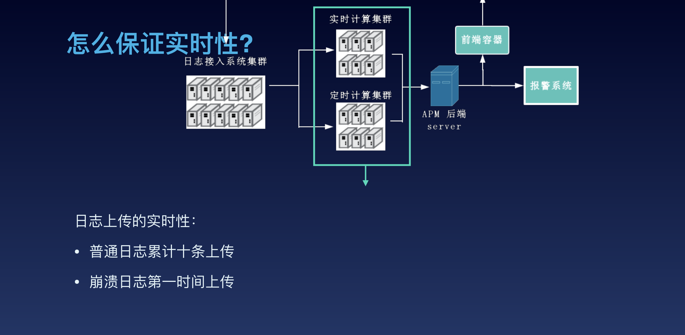

# Performance-optimization

# 一. 性能优化方向:

##### 1.内存优化
##### 2.卡顿优化
##### 3.布局优化
##### 4.启动优化
##### 5.包体积优化
##### 6.网络优化
##### 7.电量优化
##### 8.业务角度优化
##### 9.编译优化

# 二. 性能优化难点:

##### 1.没有统一的标准
##### 2.用户的机器环境相关性较大

# 三. 文档资料:

## 专题文档:

[苹果官方 Performance 专题](https://developer.apple.com/library/archive/navigation/#section=Topics&topic=Performance)

## 书籍文档:
[High Performance iOS](./doc/OReilly.High.Performance.iOS.Apps.2016.6.pdf)

[Pro iOS App Performance Optimization](./doc/Pro_ios_apps_performance_optimization.pdf)

## WWWDC 文档:

[WWDC文档](./doc/WWDC/)

## GMTC 文档:

[GMTC 2019](https://gmtc.infoq.cn/2019/beijing/#theme)
[GMTC 2018](https://gmtc.infoq.cn/2018/beijing/#theme)
[GMTC 2017](http://gmtc2017.geekbang.org/#theme)
[GMTC 2016](http://gmtc2016.geekbang.org/#theme)

# 四. 业界方案:

[微信读书 iOS 性能优化总结](http://wereadteam.github.io/2016/05/03/WeRead-Performance/)

[微信读书 iOS 质量保证及性能监控](http://wereadteam.github.io/2016/12/12/Monitor/)

工具及方法：

##### 采取的措施：

1. 现网用户的卡顿状况通过接入bugly卡顿监控，通过下发配置，对现网用户进行抽样检测，bugly的依据是监控主线程Runloop的执行，观察执行耗时是否超过预定阀值(默认阀值为3000ms)以及用户点击流来监控页面的流畅程度。在监控到卡顿时会立即记录线程堆栈到本地，在App从后台切换到前台时，执行上报。

2. 网络层成功率的监控：
统计网络请求的成功、失败率，了解所有错误码的分布情况在app新版本上线，下发补丁包，后台新功能上线，活跃用户等数据出现异常以及，用户投诉时候定期查看数据。

##### 使用到的工具：

##### 1. 内存泄露检测工具 ****MLeakFinder**** 

[TODO 原理介绍]

##### 2. FPS/SQL性能监测工具条

该工具条是在DEBUG模式下，以浮窗的形式。实时展示当前可能存在问题的FPS次数和执行时间较长的SQL语句个数，随时查看FPS低于某个阈值时的堆栈信息，当FPS低于30的时候，就会捕获所有线程堆栈，浮窗会给出红色警示，可点击查看具体的堆栈信息,再结合当时的使用场景,可以很快定位到引起卡顿的场景和原因.

因此在DEBUG阶段，我们监测了每一条SQL语句的执行速度，一旦执行时间超出某个阈值，就会表现在工具条的数字上，点击后可以进一步查询到具体的SQL操作以及实际耗时。

##### 3. UI/DataSource主线程检测工具

由于大部分UI操作是非线程安全，所有继承自UIResponder的类都需要在主线程操作，在非UI线程中操作UI可能会导致app突然丢动画，UI操作偶尔响应特别慢，莫名的crash 这些问题。UI/DataSource主线程检测工具通过 hook UIView, CALayer 的 ****-setNeedsLayout****，****-setNeedsDisplay****，****-setNeedsDisplayInRect**** 三个方法，确保它们都是在主线程执行。

[手Q iOS客户端性能监控和优化实践](https://static001.geekbang.org/con/42/pdf/3377855748/file/%E7%BD%97%E9%91%AB-%E6%89%8BQiOS%E6%80%A7%E8%83%BD%E7%9B%91%E6%8E%A7%E5%92%8C%E4%BC%98%E5%8C%96%E5%AE%9E%E8%B7%B5.pdf)

[iOS内存监控组件 OOMDetector](https://github.com/Tencent/OOMDetector)

[LinkedIn移动应用的性能优化之道](https://ppt.infoq.cn/slide/show?cid=31&pid=1495)
* 先从架构入手，引入组件化，化简架构，建立统一标准规范。
* 数据采集 - 端上性能数据采集 + 业务数据采集监控

注意点：面向切面，避免侵入业务，上传时机（服务器压力+数据实效性）,业务优先级

[去哪儿网客户端无埋点监控与性能优化实践](https://static001.geekbang.org/con/42/pdf/105012734/file/%E5%AD%9F%E8%B6%85-qunar-%E5%8E%BB%E5%93%AA%E5%84%BF%E7%BD%91%E5%85%AC%E5%85%B1%E4%BA%A7%E5%93%81%E9%83%A8%E5%A4%A7%E5%89%8D%E7%AB%AF%E8%B4%9F%E8%B4%A3%E4%BA%BA.pdf)

[美团客户端监控与异常排查实践](https://ppt.infoq.cn/slide/show?cid=31&pid=1500)
[爱奇艺APP极致体验之路](https://ppt.infoq.cn/slide/show?cid=31&pid=1497)
[从重新认识前端渲染开始，小红书的前端性能监控及优化实践](https://static001.geekbang.org/con/42/pdf/988645838/file/%E6%9D%8E%E5%AD%A3%E9%AA%8F-%E5%B0%8F%E7%BA%A2%E4%B9%A6-%E7%A4%BE%E5%8C%BA%E5%89%8D%E7%AB%AF%E5%B7%A5%E7%A8%8B%E5%B8%88.pdf)

[⼿淘iOS性能优化探索](http://pstatic.geekbang.org/pdf/593a53d813cef.pdf?e=1497499485&token=eHNJKRTldoRsUX0uCP9M3icEhpbyh3VF9Nrk5UPM:sa-xp_aIeIhtiWbqR-hY4ImMzFc=)
